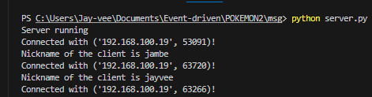

For our Event Driven Programming exercise, I will be creating a simple real-time chat application using the socket application. In essence, sockets and the socket API are used to send messages over a network.

## Real-time chat (Output)

I have images displaying the output of a simple Python real-time chat application below.

### Source code:

#### Server.py

```python
import socket
import threading

HOST = '192.168.100.19'
PORT = 5501

server = socket.socket(socket.AF_INET, socket.SOCK_STREAM)
server.bind((HOST, PORT))

server.listen()

clients = []
nicknames = []


# broadcast
def broadcast(message, sender):
    for client in clients:
        if client != sender:
            try:
                client.send(message)
            except:
                index = clients.index(client)
                clients.remove(client)
                client.close()
                nickname = nicknames[index]
                broadcast(f'{nickname} has left the chat.'.encode('utf-8'), client)
                nicknames.remove(nickname)
                break


# handle function
def handle(client):
    while True:
        try:
            message = client.recv(1024)
            if not message:
                break  # exit the loop if no message is received
            broadcast(message, client)
        except:
            index = clients.index(client)
            clients.remove(client)
            client.close()
            nickname = nicknames[index]
            broadcast(f'{nickname} has left the chat.'.encode('utf-8'), client)
            nicknames.remove(nickname)
            break


# receive function
def receive():
    while True:
        client, address = server.accept()
        print(f"Connected with {str(address)}!")

        client.send("NICK".encode('utf-8'))
        nickname = client.recv(1024).decode('utf-8')

        nicknames.append(nickname)
        clients.append(client)

        print(f"Nickname of the client is {nickname}")
        broadcast(f"{nickname} connected to the server!\n".encode('utf-8'), client)
        client.send("Connected to the server".encode('utf-8'))

        thread = threading.Thread(target=handle, args=(client,))
        thread.start()


# handle
print("Server running")
receive()

```

## SERVER.py:

``` python
import socket
import threading
```

- To handle sockets and deal with threads, this imports the threading module and the socket module.

``` python
HOST = '192.168.100.19'
PORT = 5501
```

- Sets the host IP address and port number for the server.

``` python
server = socket.socket(socket.AF_INET, socket.SOCK_STREAM)
```

- Creates a socket object using IPv4 (AF_INET) and TCP (SOCK_STREAM) for the server.
- This socket is designated as IPv4 by AF_INET and as a TCP socket for handling streams of data by SOCK_STREAM.
 
``` python
server.listen()
```

- Listens for incoming connections. The server can accept connections from clients after this call.

``` python
clients = []
nicknames = []
```

- Lists to store connected clients and their nicknames.
- To enable the server to track the quantity of clients attempting connection.

``` python
# broadcast
def broadcast(message, sender):
    for client in clients:
        if client != sender:
            try:
                client.send(message)
            except:
                # Handles exceptions if there is an issue sending a message to a client.
                index = clients.index(client)
                clients.remove(client)
                client.close()
                nickname = nicknames[index]
                broadcast(f'{nickname} has left the chat.'.encode('utf-8'), client)
                nicknames.remove(nickname)
                break
```

- Function to broadcast a message to all connected clients except the sender.

``` python
# handle function
def handle(client):
    while True:
        try:
            message = client.recv(1024)
            if not message:
                break  # exit the loop if no message is received
            broadcast(message, client)
        except:
            # Handles exceptions if there is an issue handling a client's message.
            index = clients.index(client)
            clients.remove(client)
            client.close()
            nickname = nicknames[index]
            broadcast(f'{nickname} has left the chat.'.encode('utf-8'), client)
            nicknames.remove(nickname)
            break
```

- Function to handle messages from a specific client. It continuously receives messages and broadcasts them to others.

``` python
# receive function
def receive():
    while True:
        client, address = server.accept()
        print(f"Connected with {str(address)}!")

        client.send("NICK".encode('utf-8'))
        nickname = client.recv(1024).decode('utf-8')

        nicknames.append(nickname)
        clients.append(client)

        print(f"Nickname of the client is {nickname}")
        broadcast(f"{nickname} connected to the server!\n".encode('utf-8'), client)
        client.send("Connected to the server".encode('utf-8'))

        thread = threading.Thread(target=handle, args=(client,))
        thread.start()
```

- Function to accept incoming connections from clients, receive their nicknames, and start a new thread to handle the client.

``` python
# handle
print("Server running")
receive()
```

- Initiates the server by printing a message and calling the receive function to start accepting connections.

### In its most basic configuration, the server takes on the responsibility of overseeing users. A new thread is initiated to manage messages from a connected client, and the client is included in the list. The server consistently observes each message transmitted by a client, subsequently broadcasting it to all other connected clients.

# Client.py:

``` python
import socket
import threading
import tkinter
import tkinter.scrolledtext
from tkinter import simpledialog

HOST = '192.168.100.19'
PORT = 5501

class Client:
    
    def __init__(self, HOST, PORT):
        self.sock = socket.socket(socket.AF_INET, socket.SOCK_STREAM)
        self.sock.connect((HOST, PORT))
        msg = tkinter.Tk()
        msg.withdraw()
        
        self.nickname = simpledialog.askstring("Nickname", "Please choose a nickname", parent=msg)
        
        self.gui_done = False
        self.running = True
        
        gui_thread = threading.Thread(target=self.gui_loop)
        receive_thread = threading.Thread(target=self.receive)

        gui_thread.start()
        receive_thread.start()

    def gui_loop(self):
        self.win = tkinter.Tk()
        self.win.configure(bg="gray")
    
        self.chat_label = tkinter.Label(self.win, text="Chat:", bg="lightgray")
        self.chat_label.config(font=("Arial", 12))
        self.chat_label.pack(padx=20, pady=5)
    
        self.text_area = tkinter.scrolledtext.ScrolledText(self.win)
        self.text_area.pack(padx=20, pady=5)
        self.text_area.config(state='disabled')
    
        self.msg_label = tkinter.Label(self.win, text="Message", bg="lightgray")
        self.msg_label.config(font=("Arial", 12))
        self.msg_label.pack(padx=20, pady=5)
    
        self.input_area = tkinter.Text(self.win, height=3)
        self.input_area.pack(padx=20, pady=5)

        self.send_button = tkinter.Button(self.win, text="Send", command=self.write)
        self.send_button.config(font=("Arial", 12))
        self.send_button.pack(padx=20, pady=5)
    
        self.gui_done = True
    
        self.win.protocol("WM_DELETE_WINDOW", self.stop)
    
        self.win.mainloop()
    
    def write(self):
        message = f"{self.nickname}: {self.input_area.get('1.0', 'end')}"
        self.sock.send(message.encode('utf-8'))
        self.input_area.delete('1.0', 'end')

    def stop(self):
        self.running = False
        self.win.destroy()
        self.sock.close()
        exit(0)

    def receive(self):
        while self.running:
            try:
                message = self.sock.recv(1024).decode('utf-8')
                if message == 'NICK':
                    self.sock.send(self.nickname.encode('utf-8'))
                else:
                    if self.gui_done:
                        self.text_area.config(state='normal')
                        self.text_area.insert('end', message)
                        self.text_area.yview('end')
                        self.text_area.config(state='disabled')
            except ConnectionAbortedError:
                break
            except:
                print("Error")
                self.sock.close()
                break

# Create an instance of the Client class
client_instance = Client(HOST, PORT)
```
## CLIENT.py:

``` python
import socket
import threading
import tkinter
import tkinter.scrolledtext
from tkinter import simpledialog
```

- Imports necessary modules: ***socket*** for networking, ***threading*** for working with threads, and ***tkinter*** for the GUI components.
- Socket: Creating and managing sockets.
- Threading: This module enables the simultaneous execution of multiple threads.
- Tkinter: Necessary for creating a graphical user interface (GUI) for the application.
- ScrolledText: A widget utilized to enable scrolling within the text area.
- SimpleDialog: Employed to generate a dialog for inputs, such as usernames.

``` python
HOST = '192.168.100.19'
PORT = 5501
```

- Same goes to Server, Sets the host IP address and port number for the client to connect to the server.
- The PORT serves as the client's port number, and the HOST specifies the IP address—similarly applicable to the server.

``` python
class Client:
    
    def __init__(self, HOST, PORT):
        self.sock = socket.socket(socket.AF_INET, socket.SOCK_STREAM)
        self.sock.connect((HOST, PORT))
        msg = tkinter.Tk()
        msg.withdraw()
```

- Defines a class "Client" with an ***__init__*** method. Initializes a socket for the client and connects to the server. Also, creates a hidden Tkinter window ***(msg)*** for user input.
- `socket.socket`: Utilized for creating new sockets.
- `socket.AF_INET`: Indicates that the address belongs to the IPV4 address family.
- `socket.SOCK_STREAM`: Identifies the socket type, specifying it as a TCP socket.
- `connect((HOST, PORT))`: Establishes the connection to the server by setting up the host and port.
``` python
        self.nickname = simpledialog.askstring("Nickname", "Please choose a nickname", parent=msg)
```

- Asks the user to choose a nickname using a Tkinter dialog.

``` python
        self.gui_done = False
        self.running = True
        
        gui_thread = threading.Thread(target=self.gui_loop)
        receive_thread = threading.Thread(target=self.receive)

        gui_thread.start()
        receive_thread.start()

```

- Initializes variables for GUI status and running status. Creates two threads for the GUI loop ***(gui_thread)*** and message receiving ***(receive_thread)*** and starts them.

``` python
    def gui_loop(self):
        self.win = tkinter.Tk()
        self.win.configure(bg="gray")
```

- Defines the ***gui_loop*** method to create and configure the main GUI window.

``` python
        self.chat_label = tkinter.Label(self.win, text="Chat:", bg="lightgray")
        self.chat_label.config(font=("Arial", 12))
        self.chat_label.pack(padx=20, pady=5)
    
        self.text_area = tkinter.scrolledtext.ScrolledText(self.win)
        self.text_area.pack(padx=20, pady=5)
        self.text_area.config(state='disabled')
```

- Configures and packs labels and a scrolled text area for displaying the chat messages.

``` python
        self.msg_label = tkinter.Label(self.win, text="Message", bg="lightgray")
        self.msg_label.config(font=("Arial", 12))
        self.msg_label.pack(padx=20, pady=5)
    
        self.input_area = tkinter.Text(self.win, height=3)
        self.input_area.pack(padx=20, pady=5)
```

- Configures and packs labels and a text area for typing messages.

``` python
        self.send_button = tkinter.Button(self.win, text="Send", command=self.write)
        self.send_button.config(font=("Arial", 12))
        self.send_button.pack(padx=20, pady=5)
    
        self.gui_done = True
    
        self.win.protocol("WM_DELETE_WINDOW", self.stop)
    
        self.win.mainloop()
```

- Configures and packs a button for sending messages. Sets ***gui_done*** to True, binds the window close event to the ***stop*** method, and starts the Tkinter main loop.

``` python
    def write(self):
        message = f"{self.nickname}: {self.input_area.get('1.0', 'end')}"
        self.sock.send(message.encode('utf-8'))
        self.input_area.delete('1.0', 'end')
```

- Defines the ***write*** method to send messages to the server.

``` python
    def stop(self):
        self.running = False
        self.win.destroy()
        self.sock.close()
        exit(0)
```

- Defines the ***stop*** method to stop the client, close the GUI, close the socket, and exit the program.

``` python
    def receive(self):
        while self.running:
            try:
                message = self.sock.recv(1024).decode('utf-8')
                if message == 'NICK':
                    self.sock.send(self.nickname.encode('utf-8'))
                else:
                    if self.gui_done:
                        self.text_area.config(state='normal')
                        self.text_area.insert('end', message)
                        self.text_area.yview('end')
                        self.text_area.config(state='disabled')
            except ConnectionAbortedError:
                break
            except:
                print("Error")
                self.sock.close()
                break
```

- Defines the ***receive*** method to continuously receive messages from the server and update the GUI text area. Handles disconnection errors.

``` python
# Create an instance of the Client class
client_instance = Client(HOST, PORT)
```

- Creates an instance of the ***Client*** class, initiating the client application with the specified host and port.
## Output #1:


To handle two or more users, the server.py (server-side) must be run twice or more. The client.py (client-side) must also be run simultaneously. As you can see from the picture or photo, I had two clients connected to the server by running the server.py and the client.py twice. The username can be created or chosen by the user or customer.

## Output #2:


From this we can see that after adding a new client, it will notify the other client that there's a another client is joining.

## Output #3:


From this we can see that the Two windows, which stand in for the clients connected to the server, are seen in the figure. In this case, two network-running processes are connected via a two-way communication channel, with one socket serving as one of the ends. Using socket programming to create simple real-time chat apps is helpful.

## Output #4:



Here we can see that the server is listening to two clients, where the server can listen both clients.

### In summary, this code establishes a connection for a chat application between a client and a server. It employs tkinter for a graphical interface, incorporates message sending and receiving functionalities, and implements a thread to handle continuous message reception.


